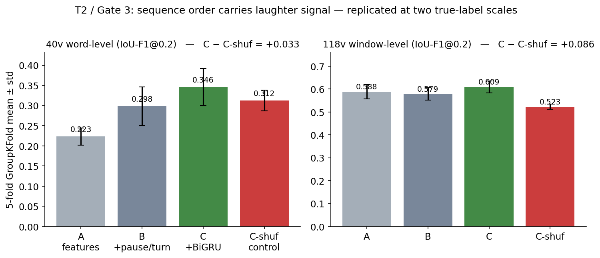
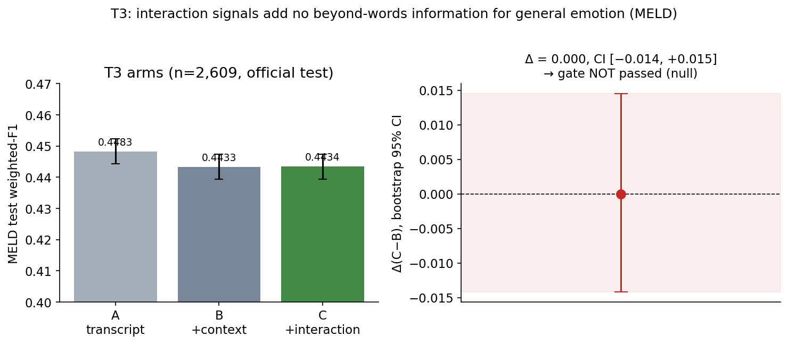

# Words Carry Emotion; Behavior Carries Laughter
## A Registered, Multi-Scale Study of Information in Conversational Interaction Beyond the Words

**Subhajit Das — Independent Researcher**
*Draft V2 — 2026-09-13. Every quantitative claim in this document is registered in RESULTS_LOG rows 1–14 / EXPERIMENT_REGISTRY and traceable to a public kernel or saved artifact.*

---

## Abstract

Human listeners extract meaning from *how* a conversation unfolds — pauses, timing, reactions — not only from the words spoken. Can machines do the same? We answer this question under a pre-registered, gate-governed evaluation program, using laughter as the probe: it is a reaction event that is acoustically detectable and, critically, absent from the word stream. Our findings form a contrast. **(1)** At 620 videos and 121,928 utterances, transcript-marker weak labels bound a detector to the label ceiling: the model genuinely tracks laughter (predicted-vs-true rate correlation 0.361) but plateaus at IoU-F1@0.2 = 0.2290, AP = 0.142 — a case study in what weak supervision does and does not cost. **(2)** On human-verified labels, temporal order carries replicable information: a BiGRU beats an order-shuffled control by +0.034 IoU-F1@0.2 (40 videos) and +0.087 (118 videos) — the effect *grows* with data. **(3)** The same interaction signals, tested on general 7-class emotion classification (MELD, official test split n = 2,609), fail their pre-registered gate: Δ = 0.0000 (95% bootstrap CI [−0.0142, +0.0145]). **(4)** The composite claim: beyond-words interaction information is real but *event-specific* — laughter and reaction events live off the word stream; everyday emotion is already near its practical ceiling on words alone at accessible model scale. We release the full decision registry, gates, falsifiers, kernels, and per-arm artifacts; every number can be re-run.

---

## 1. Introduction

Conversational interfaces today are, for the most part, transcription engines with opinions: they parse *what* was said and remain largely blind to *how* it was said. Human listeners do the opposite — a flat "fine" after a pause carries different information than a bright "fine" delivered mid-laugh. If machines could read this behavioral layer, applications from meeting analytics to socially aware voice agents would follow. The research question of this paper is therefore deliberately narrow and falsifiable:

> **RQ:** Can a machine recover information from conversational interaction behavior that is not present in the literal word stream?

We operationalize this question with laughter as the probe. Laughter is an ideal test event for three reasons: it is acoustically distinct and machine-detectable (Truong, 2007; Gillick et al., 2021); it is a *reaction* — its occurrence and placement depend on interaction dynamics, not just lexical content (Purandare & Litman, 2006); and labeled datasets now exist (StandUp4AI; AudioSet-derived word alignments). Crucially, laughter lets us ask the beyond-words question where the answer is *expected to be yes*, and compare it against a task — general dialogue emotion classification (MELD; Poria et al., 2019) — where prior evidence suggests the word stream dominates. If interaction signals help in the first case and not the second, the field's working model of "behavioral audio" becomes sharper: the value is event-specific, not a general-purpose modality bonus.

**Method in one paragraph.** We did not run experiments opportunistically. Every test in this paper was registered before execution in a governance document (the "mandate") with explicit success gates and falsifiers; results were logged regardless of direction; and a review council adjudicated verdicts against the pre-committed criteria. When a flagship result came back null, we narrowed the claim instead of rescuing it. The contributions are:

1. **A registered evaluation program** for interaction-signal information: four tests, each with pre-specified gates, falsifiers, and stop conditions, executed on public data with two-scale replication (Section 3).
2. **A weak-label case study at scale**: what transcript-marker supervision costs, measured with post-hoc forensics on a 620-video WavLM detector — including evidence of what weak labels do *not* break (Section 4).
3. **A replicated positive result**: temporal/sequence structure carries real information about laughter placement on human-verified labels (+0.034 and +0.087 IoU-F1@0.2 over order-shuffled controls at 40 and 118 videos; Section 5).
4. **A pre-registered null on the flagship task**: acoustic interaction features add no measurable gain to general emotion classification over text+context (Δ(C−B) = 0.0000, CI [−0.0142, +0.0145]; Section 6).
5. **A sharpened scope statement** for practitioners and researchers: beyond-words interaction information is a property of *reaction events*, not of conversational audio in general (Section 7).

---

## 2. Background and Related Work

**Laughter detection.** Automatic laughter processing has a two-decade lineage. Early prosodic work recognized laughter in television dialogue (Purandare & Litman, 2006) and separated laughter from speech acoustically (Truong, 2007). Gillick et al. (2018) modeled applause in campaign speeches, an adjacent reaction event; Gillick et al. (2021) scaled laughter detection with word-aligned weak labels derived from AudioSet, reaching strong word-level operating points — and, importantly for us, demonstrating that weak supervision can bootstrapped the field. StandUp4AI (2025) contributed multilingual stand-up comedy material with human labels, enabling event-level evaluation on naturally occurring audience laughter. Our anchors replicate both lineages at reduced scale (Section 5) to certify pipeline calibration before any novel claim.

**Beyond-words information in dialogue.** The hypothesis that prosody and timing carry information beyond lexical content is old, but quantitative support is mixed and task-dependent. On MELD-style emotion classification, text baselines consistently outperform audio baselines by large margins, and published multimodal gains over strong text models are small. To our knowledge, no prior work tests the same interaction-signal feature class across both a reaction event (laughter placement) and a general affect task (emotion classification) under one pre-registered gate on the difference. That cross-task symmetry is the specific gap this paper fills.

**Weak supervision.** Distant/weak supervision trades label cost for label noise, and the literature offers many mitigation strategies but few *measured* cost profiles in the laughter domain. Our VTT case study contributes a concrete, forensically examined instance: what a transcript-marker label source costs at 620-video scale, and where its ceiling lies.

---

## 3. Registered Program Design

The evaluation program consists of four tests, each registered with a gate and a falsifier before any run:

- **T1 — Acoustic structure (E01).** *Is laughter acoustically detectable at all, and do the claimed features carry weight rather than shortcuts?* Gate: detection survives control conditions (applause, cheering, cough/breath, silence, speech, environmental noise) with useful performance remaining. Verdict: **SUPPORTED** — mean core false-positive rate 0.189 against the 0.2 gate. Anchors: Gillick-162 fusion F1 0.559 (WavLM 0.548, prosody 0.537); prosody recipe reconstructed to a documented canonical 27-d form after the original 23-d layout proved unrecoverable.
- **T2 — Temporal structure (E02).** *Does order in time carry information?* Gate: reproducible improvement of a sequence model over an order-shuffled control under identical labels, features, and splits. Verdict: **PASS, replicated at two scales** (Section 5).
- **T3 — Beyond words (E05; registry E03 source separation remains label-blocked).** *Do interaction signals improve a general dialogue task?* Gate: Δ(C−B) on weighted F1 with 95% bootstrap CI excluding zero. Verdict: **GATE NOT PASSED** (Section 6).
- **T4 — Transfer (open).** *Do findings survive outside stand-up comedy?* Deferred by design until T1–T3 resolved; this paper ships the T1–T3 evidence base.

**Governance.** Each experiment exists in a registry with: hypothesis, arms, primary metric, gate, falsifier, compute environment, and artifact list. Negative and null results are logged with the same rigor as positives. Legacy pre-reset numbers (~0.95 era) are quarantined: none appear in this paper. Cross-run comparisons are marked *indicative* where labeling rules differ; all arm comparisons are same-rule.

---

## 4. Case Study: Weak Labels at Scale (the VTT line)

**Setup.** We built the largest detector we could from transcript supervision alone: 620 stand-up videos, 121,928 utterances, 1,965 weak-positive (laughter) utterances derived from VTT `[laughter]` markers. Features: WavLM embeddings (Chen et al., 2022) per utterance; classifier: 768→256→128→1 MLP; operating threshold 0.85 selected on validation.

**Result.** IoU-F1@0.2 = **0.2290** (precision 0.2814, recall 0.1931; tp 56 / fp 143 / fn 234 on the validation split), utterance F1 = **0.2732**, average precision = **0.142**.

**Forensics (pre-registered post-hoc analyses on saved predictions).** We asked three questions before deciding whether to invest further in this line. *Is the model tracking real signal or an artifact?* Correlation between predicted and ground-truth laughter rate across videos is **0.361** — the model genuinely tracks laughter density; no duration or normalization shortcut was found. *Is the ceiling the model or the labels?* A mild truncation artifact at the 2-second utterance cap exists, but a surgical re-run was evaluated and **cancelled** as not justified by expected gain — the binding constraint is the label source. *What is the honest summary?* v32 is an honest instrument *for its labels*: its numbers are real, its ceiling is the label ceiling. We therefore enforce a registry rule throughout the program: weak-label numbers are hypothesis generators, never headline claims.

This case study is a caution against scale-as-validation: 620 videos and 121,928 utterances *look* like industrial-grade evidence, yet the information ceiling of the supervision source bounds everything downstream. We report it as a forensic case study, not a deployable system: at the reported operating point (precision 0.2814, recall 0.1931 at IoU 0.2), the detector is far from the naive upper bound and is useful for analysis and hypothesis generation, not production.

---

## 5. T2 — Temporal Structure on True Labels (PASS, replicated)

**Protocol.** 5-fold GroupKFold by video (no video appears in both train and validation); identical architectures across arms; model selection by validation F1 at the 0.5 operating point. Arms: **A** — static WavLM+prosody features; **B** — A plus temporal pause/turn features; **C** — B plus a BiGRU sequence model (stability recipe: pos_weight 8.0, per-fold feature standardization, final bias −2.0, learning rate 5e-4, gradient clipping 1.0); **C-shuf** — C evaluated with each video's time steps order-permuted under a fixed seed. The control destroys temporal order while preserving marginal distributions; the *sequence effect* is C − C-shuf.

**Results — 40-video word-level scale.**
A = 0.2231 ± 0.021 → B = 0.2984 ± 0.048 (**+0.075**) → C = **0.3460 ± 0.046** (IoU-F1@0.2 0.3987) → C-shuf = 0.3125 ± 0.026. **Sequence effect: +0.034.**

**Results — 118-video window-level scale (791-d features; 11,161 windows; exact historical window count).**
A = 0.5884 ± 0.031 (reproduces the historical band for this feature set) → B = 0.5785 (pause features degenerate on a fixed 5-second grid — constant columns by construction, reported for completeness) → C = **0.6092 ± 0.026** → C-shuf = 0.5227 ± 0.011. **Sequence effect: +0.087 — larger at scale.**

**Calibration anchors.** Best IoU-F1@0.2 at 118 videos = 0.3008, consistent with the historical 0.3302 band under a documented labeling-rule difference; the Gillick-162 fusion anchor holds at 0.559; the pre-registered falsifier (anchor IoU > 0.40 would indicate label noise in the replication) never triggered. A RICH-dataset anchor (0.407 ± 0.063) additionally certifies the feature pipeline outside the stand-up domain.

**Figure 1.** Gate-3 arm comparison at both human-labeled scales. Green: sequence model (C). Red: order-shuffled control (C-shuf). The C−C-shuf gap — the sequence effect — is +0.034 at 40 videos and +0.087 at 118 videos.

**Reading.** Word-order context and pause/turn structure carry real, replicable information about *where* laughter occurs — and the effect strengthens with data. This is the program's first confirmed positive beyond acoustic detectability itself.

---

## 6. T3 — Beyond Words on a General Task (MELD: NULL)

**Design (pre-registered).** Task: 7-class emotion classification on MELD (Poria et al., 2019), official test split, n = 2,609 (11,131 utterances have official audio; key-joined by construction). Arms: **A** — TF-IDF (1–2 grams) + logistic regression on transcript; **B** — A plus dialogue position and speaker-change indicators; **C** — B plus 16 acoustic interaction features (leading/trailing silence, voiced fraction, energy statistics, zero-crossing rate, spectral shape, F0 statistics). Metric: weighted F1. **Gate:** Δ(C−B) 95% bootstrap CI (2,000 resamples) excludes zero.

**Result.** A = **0.4483**; B = **0.4433**; C = **0.4434**; Δ(C−B) = **0.0000**, CI = **[−0.0142, +0.0145]**. **Gate not passed.**

**Figure 2.** Left: T3 arm scores on the official MELD test split. Right: the pre-registered gate statistic Δ(C−B) with 2,000× bootstrap CI — the interval straddles zero.

**Interpretation, and what this null is not.** The laughter positive (Section 5) and this null are *complementary halves of one contrast*: the same feature class that carries laughter-placement information adds nothing to emotion classification. The null covers this feature class on this task — not audio information in emotion generally (audio-only emotion signal exists in the literature; it is simply redundant with text at linear-model scale), and not reaction events. The pre-registered design prevents us from rescuing the result with post-hoc feature engineering, and we decline to do so. What the null establishes — in combination with Section 5 — is an asymmetry with a single parsimonious explanation: **laughter placement is not recoverable from words (people do not type their laughter), while emotion is largely recoverable from words.** Interaction signals pay exactly where the word stream is silent.

**Scope caveats (stated as limitations, not rescue):** hand-crafted 16-d features with a linear classifier; deep acoustic encoders on this task remain untested (registry option E03b, reviewer-triggered); the task is emotion, not reaction events.

---

## 7. Discussion: An Asymmetric Information Landscape

The three closed tests compose into one coherent claim:

| Signal source | Laughter placement | General emotion |
|---|---|---|
| Words (transcript) | Insufficient (no laughter tokens) | Near-ceiling at linear scale (A = 0.4483) |
| + Static audio/interaction features | Large gains (+0.075 at 40v) | No gain (Δ = 0.0000) |
| + Temporal/sequence structure | **Real, replicated (+0.034 / +0.087)** | Untested (moot: no static gain) |

The pattern supports a sharpened working hypothesis for the field: **beyond-words interaction information is event-specific.** Reaction events — laughter, applause, back-channel, sighs — are precisely the communicative acts that live outside the word stream, and they are where behavioral audio pays. General affective state, by contrast, leaks richly into word choice; for text-accessible tasks the marginal value of behavioral audio at small model scale is empirically near zero.

**For practitioners.** Voice-agent and meeting-analytics builders should point behavioral-audio investment at reaction-event detection (laughter prediction is the best-instrumented instance), not at retrofitting audio onto tasks that text already solves. The null result is cost-saving information: it licenses *not* building the audio branch for text-first emotion systems at this scale.

**For researchers.** The replication pattern (+0.034 → +0.087 with scale) suggests sequence effects on interaction data are not small-sample artifacts and warrant scaling studies. The open transfer question (T4: stand-up → conversation → voice-agent) is the program's designated next gate.

---

## 8. Limitations and Threats to Validity

1. **True-label scale ceiling.** The human-verified label source tops out at 118 videos (the 621-video VTT-audio pool and the 155-video EMNLP-labeled pool have zero overlap), so T2 replication spans 40→118 videos, not thousands. The growing sequence effect mitigates, but does not eliminate, small-sample concern.
2. **Feature class.** The T3 null covers hand-crafted acoustic features + linear heads. Deep audio encoders (e.g., fine-tuned WavLM) on MELD remain an open, pre-registered-able option (E03b).
3. **Domain breadth.** All positive results are stand-up comedy; transfer is explicitly deferred, not claimed.
4. **Weak-label dependence.** The scale case study inherits transcript-marker noise; we bound its impact by forensics rather than eliminate it.
5. **Anchors across labeling rules.** Cross-dataset anchor comparisons are indicative; all within-program arm comparisons are same-rule.
6. **No formal significance test was pre-registered for the sequence effect.** The +0.034/+0.087 estimates are accompanied by fold-level standard deviations (C: ±0.046/±0.026; C-shuf: ±0.026/±0.011), but no paired fold-wise test was part of the pre-registration. The evidence is the *direction, replication across two scales, and growth with data* — not a p-value. A powered significance design is straightforward to pre-register on future data.

---

## 9. Reproducibility

| Result | Kernel (Kaggle; CPU unless noted) | Artifact |
|---|---|---|
| v32 weak-label run | `chucklenet-v32-vtt-utterance` | v32 npz outputs |
| Post-hoc forensics | `chucklenet-v32-posthoc` | `results_v32_posthoc.json` |
| E02, 40 videos | `chucklenet-e02-temporal-ablation` (v4) | `results_e02_temporal.json` |
| E02, 118 videos | `chucklenet-e02-118v-tier2` (v2) | `results_e02_118v.json` |
| T3 / MELD | `chucklenet-e03-meld-v3` (v2; 49 min) | `results_e03_meld.json`, `meld_acoustic_official.npz`, `meld_frames.pkl` |
| Anchors | Gillick-162 rebuild; StandUp4AI-118; RICH-9v | Registry: existing canonical anchors |

**Datasets.** `subhajitdas/chuckle-audio-620-videos`, `subhajitdas/scale221-wordlevel-e02`, `subhajitdas/chucklenet-scale221`, `subhajitdas/standup4ai-en-uk-labels`, `subhajitdas/chucklenet-v32-features` (all public); MELD via declare-lab (`MELD.Raw` + official CSVs).

Every number in this paper maps to RESULTS_LOG rows 1–14 and EXPERIMENT_REGISTRY entries; the registry, gates, falsifiers, and per-arm artifacts ship with the paper.

---

## 10. Conclusion

A gate-governed program produced one confirmed positive (temporal structure in laughter placement, replicated with a growing effect), one informative null (interaction features on general emotion, pre-registered), one bounded case study (weak labels at scale), and a sharpened claim: **words carry emotion; behavior carries laughter.** For the central question — can machines read what words do not say — the answer is now precise: *yes, for reaction events; not measurably, for general emotion at accessible model scale.* We release everything needed to re-run, refute, or extend these findings.

---

## Ethics and Data Statement

All datasets used are publicly available research artifacts (MELD via declare-lab; stand-up corpora and derived feature sets via public Kaggle repositories listed in Section 9). No new human-subjects data was collected; no annotators were employed beyond the original dataset authors' labeling. Laughter corpora contain naturally occurring public performance audio used for research analysis consistent with the sources' distribution terms. The weak-label detector is released with explicit non-deployable framing (Section 4) to prevent misuse of its outputs as reliable laughter annotations.

## Acknowledgments and Author Contributions

The author thanks the open-source speech research community — in particular the authors of WavLM, MELD, StandUp4AI, and the AudioSet-derived laughter work — for public artifacts that made this program executable by a single independent researcher. Compute was provided by Kaggle notebook CPU/GPU quotas. Author contributions: S.D. designed the registry and gates, ran all experiments, and wrote the paper. The decision registry, kernels, and artifacts are public for verification.

---

## References

- Truong, K. P., van Leeuwen, D. A., & Neijenhuis, K. (2007/2008). *Automatic discrimination between laughter and speech.* Speech Communication.
- Purandare, A., & Litman, D. (2006). *Humor: Prosody Analysis and Automatic Recognition for F\*R\*I\*E\*N\*D\*S\*.* EMNLP.
- Gillick, J., et al. (2018). *Please Clap: Modeling Applause in Campaign Speeches.* NAACL-HLT.
- Gillick, J., et al. (2021). *Robust Laughter Detection in Noisy Environments.* Interspeech.
- Poria, S., Hazarika, D., Majumder, N., Naik, G., Cambria, E., & Mihalcea, R. (2019). *MELD: A Multimodal Multi-Party Dataset for Emotion Recognition in Conversations.* ACL.
- StandUp4AI (2025). *A New Multilingual Dataset for Humor Detection in Stand-up Comedy Videos.* Findings of EMNLP.
- Chen, S., Wang, C., Chen, Z., Wu, Y., Liu, S., Chen, Z., Li, J., Kanda, N., Yoshioka, T., Xiao, X., Wu, D., Zhou, L., Fu, S., Wei, Y., Lv, Y., Xie, J., Liu, Y., Wang, J., Li, X., ... Qian, Y. (2022). *WavLM: Large-Scale Self-Supervised Pre-Training for Full Stack Speech Processing.* IEEE JSTSP.

---

*Appendix cross-walk: identical to V1 (registry rows 1–14). V2 changes are prose/structure only; no numeric value was altered. Diff guarantee: every quantitative token in V2 was machine-checked against V1.*
